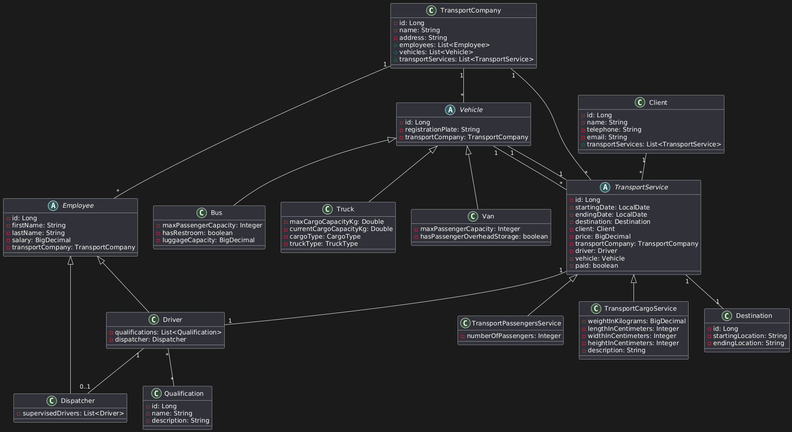

# Transport Management System

The **Transport Management System** is a Java-based application designed developed as a final project for the **CSCB525
Applied Programming in Java** course at the **New Bulgarian university**. It provides a centralized platform to manage
transport companies, clients, employees, vehicles, and transport
services (both passenger and cargo). With support for CRUD operations, sorting, filtering, reporting, and data
serialization/deserialization, this system is a complete solution for transport logistics management.

## Table of Contents

- [Features](#features)
- [Architecture](#architecture)
- [Class Diagram](#class-diagram)
- [Installation](#installation)
- [Usage](#usage)
- [Testing](#testing)
- [Logging](#logging)
- [Contributing](#contributing)
- [License](#license)

## Features

- **Transport Company Management**: Create, update, delete, and list transport companies.
- **Client Management**: Manage client details and their transport service history.
- **Employee Management**: Handle employees (drivers, dispatchers) with qualifications and assignments.
- **Vehicle Management**: Manage different vehicle types (buses, trucks, vans) with specific attributes.
- **Transport Services**: Record, update, and manage both passenger and cargo transport services.
- **Payment Tracking**: Track whether clients have paid for services.
- **Sorting and Filtering**: Sort and filter companies, employees, and services by various criteria.
- **Reporting**: Generate reports on transports, revenue, driver activity, and more.
- **Data Serialization/Deserialization**: Export and import transport service data to/from files using JSON.
- **Validation**: Ensure data integrity with input validation using Jakarta Bean Validation.
- **Logging**: Integrated logging with SLF4J and Logback for monitoring and debugging.

## Architecture

The application is built using a layered architecture to ensure separation of concerns, maintainability, and
scalability:

- **Data Layer**: Handles database interactions using Hibernate ORM and JPA, with an H2 in-memory database for
  development and testing.
- **Service Layer**: Contains the business logic, including CRUD operations, sorting, filtering, and reporting
  functionalities.
- **Controller Layer**: Manages user input and output via a console-based interface.
- **Serialization Layer**: Facilitates data export/import using a custom `ServiceSerializer` class with Gson for JSON
  processing.

### Technologies Used

- **Java 23**: Core programming language.
- **Hibernate 6.2.0**: ORM framework for database management.
- **H2 Database**: Lightweight in-memory database for testing and development.
- **MySQL Connector**: For optional MySQL database support.
- **Gson**: Library for JSON serialization and deserialization.
- **SLF4J & Logback**: Logging framework for monitoring and debugging.
- **Jakarta Bean Validation**: Ensures data integrity through input validation.
- **JUnit 5**: Framework for unit and integration testing.
- **ModelMapper**: For object mapping between DTOs and entities.
- **PlantUML**: Tool for generating UML class diagrams to visualize the system architecture.

## Class Diagram

Below is a simplified UML class diagram illustrating the key entities and their relationships in the Transport
Management System:



## Installation

Follow these steps to set up the Transport Management System locally:

1. **Clone the repository**:

  ```
  git clone https://github.com/yourusername/transport-management-system.git
  ```

2. **Navigate to the project directory**:

```
cd transport-management-system
```

3. **Configure Environment Variables**:

- Create a local `hibernate.properties` file in `src/main/resources` with these properties (not tracked
  by Git):
  ```
  hibernate.connection.username=root
  hibernate.connection.url=jdbc:h2:mem:testdb
  hibernate.connection.password=your_secure_password
  hibernate.hbm2ddl.auto=update
  ```
- A template file, `hibernate.properties.example`, is provided in the repository for reference.

4. **Build the project using Gradle**:

  ```  
  ./gradlew build
  ```

- On Windows, use:
  ```
  gradlew.bat build
  ```

5. **Run the application**:

```
   ./gradlew run
```

## Usage

The application features a console-based interface. Upon launch, a main menu provides options to manage transport
companies, clients, employees, vehicles, transport services, and data serialization/deserialization.

### Example Interaction

```
--- Main Menu ---
1. Manage Transport Companies
2. Manage Clients
3. Manage Dispatchers
4. Manage Drivers
5. Manage Qualifications
6. Manage Cargo Services
7. Manage Passenger Services
8. Manage Destinations
9. Manage Trucks
10. Manage Buses
11. Manage Vans
12. Manage Serialization
0. Exit
Enter your choice: 1

--- Transport Company Management ---
1. List all companies
2. Add a new company
3. Update a company
4. Delete a company
Enter your choice: 2
Enter company name: SwiftMove Transport
Enter address: 456 Oak Ave, Townsville
Transport company created with ID: 1
```


## Testing

The project includes extensive unit and integration tests using JUnit 5, covering the data layer, service layer, and
serialization functionality.
To run the tests:

  ```
  ./gradlew test
  ```

## Logging

Logging is implemented using SLF4J with Logback. Logs are output to the console by default and can be customized via the
`logback.xml` file located in `src/main/resources`.

## Contributing

As this is a university course project contribuiting is generally not required.

## License

This project is licensed under the MIT License. See the [LICENSE](https://github.com/StefanYankov/TransportCompanyManagementSystem/blob/main/LICENSE) file for details.


